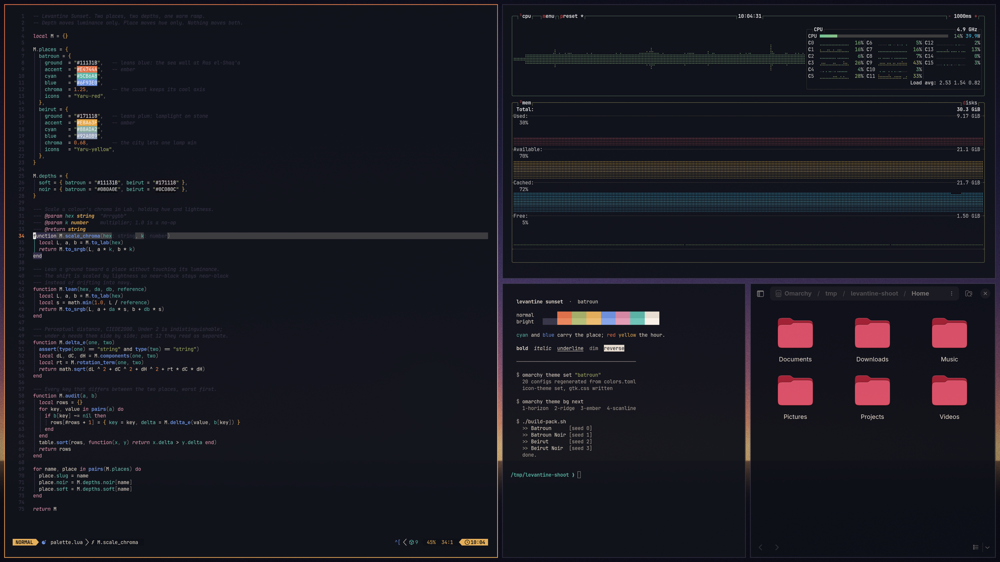
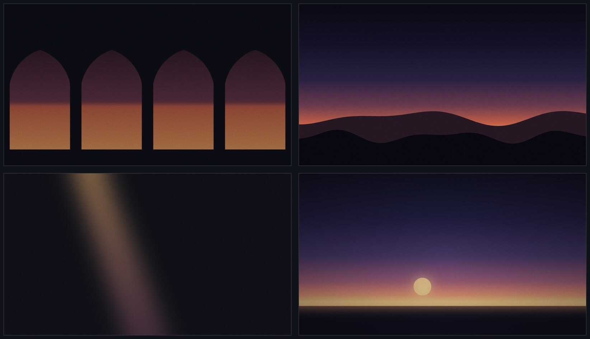
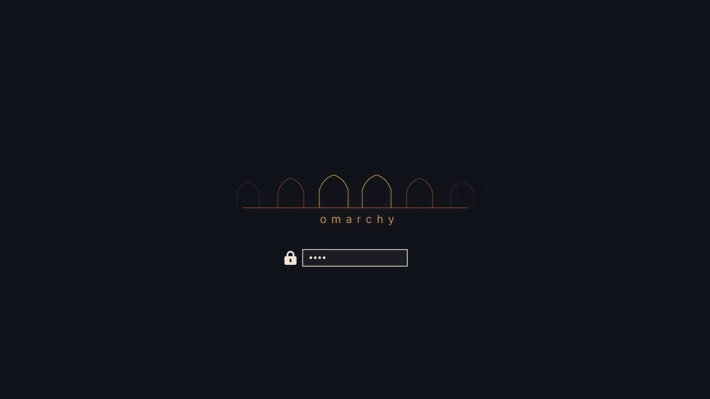

# Batroun

The coast. The Phoenician sea wall at Ras el-Shaq’a, sun going down over the water.

One of four themes in **Levantine Sunset** — two places, each at two depths.
Ember and gold on a blue-leaning indigo base.



## Install

```sh
omarchy theme install https://github.com/gaius-codius/omarchy-batroun-theme
```

Then pick it from the theme menu, or `omarchy theme set "Batroun"`.

## Palette

| key | |
|---|---|
| `accent` | `#E4744A` |
| `background` | `#11131B` |
| `foreground` | `#EDE3D6` |
| `red` | `#E4744A` |
| `yellow` | `#E8B25C` |
| `green` | `#A8B36A` |
| `cyan` | `#5CB6A8` |
| `blue` | `#6F93E0` |
| `magenta` | `#D98BA6` |

The full set is in [`colors.toml`](colors.toml). Depth moves luminance only and
place moves hue only, so the two axes stay independent: both depths of a place
share every accent, and both places at a depth share the same luminance on every key.

## Wallpapers



Left to right, top to bottom, in the order listed below.

| file | |
|---|---|
| `1-colonnade` | pointed arches cut from a dark wall, evening beyond |
| `2-ridge` | two rolling silhouettes against a horizon |
| `3-shaft` | one warm beam falling through the dark |
| `4-scanline` | a horizon on a CRT, every third row dimmed |

All four are generated procedurally from this theme's own hex values — there are no
source photographs. Cycle them with `omarchy theme bg next`, or drop your own into
`~/.config/omarchy/backgrounds/batroun/`.


## Boot and login screen



Omarchy styles the Plymouth boot splash and the SDDM login screen together, from
this theme's `background`, `foreground` and `unlock.png`. Applying it is a
**separate, one-time, root operation** — `omarchy theme set` does not touch either
screen, so installing this theme leaves whatever greeter you already had:

```sh
omarchy plymouth set by theme batroun
```

The argument is the directory slug — the name `omarchy plymouth list` prints — not the
display name. It needs root and rebuilds the initramfs, so give it a minute. To see what is
currently applied (it prints the same slug), or to go back to the stock Omarchy screen:

```sh
omarchy plymouth current
omarchy plymouth reset
```

`unlock.png` is the boot **logo mark** — a pointed arcade with a quiet lowercase
`omarchy` beneath it, the same arcade that is the subject of `1-colonnade`. It is not
a wallpaper and not the Hyprland lock screen, which uses your current background
instead. `preview-unlock.png` is the composed 1920x1080 render above, and is what
`omarchy plymouth switcher` shows in its picker.

To render that preview yourself without applying anything:

```sh
omarchy plymouth preview '#11131B' '#EDE3D6' unlock.png /tmp/preview.png
```

Note it opens the result fullscreen in `imv` when it finishes; close it to get your
prompt back.

## The rest of the collection

[Batroun Noir](https://github.com/gaius-codius/omarchy-batroun-noir-theme) · [Beirut](https://github.com/gaius-codius/omarchy-beirut-theme) · [Beirut Noir](https://github.com/gaius-codius/omarchy-beirut-noir-theme)

All four, plus the generator that builds them:
[levantine-sunset](https://github.com/gaius-codius/levantine-sunset)

## Optional: matching file-manager colours

`omarchy theme set` does touch GTK — `omarchy-theme-set-gnome` sets `color-scheme`,
`gtk-theme` and `icon-theme` on every switch — but `gtk-theme` is only ever
`Adwaita` or `Adwaita-dark`, so a theme's *colours* never reach GTK and every dark
theme yields an identical Nautilus. This theme ships an `icons.theme` so at least
the folder icons match its accent, which is the documented mechanism and travels
with the theme.

Carrying the actual colours needs a machine-level template, because there is no
sanctioned way to ship one inside a theme. It applies to **every** installed theme,
stock ones included — which is why it isn't in this repo:

    ~/.config/omarchy/themed/gtk.css.tpl        # the template
    ~/.config/gtk-4.0/gtk.css -> ~/.local/state/omarchy/current/theme/gtk.css

`omarchy-theme-set-templates` globs `~/.config/omarchy/themed/*.tpl`, so adding a
template makes every theme generate a `gtk.css` alongside its `ghostty.conf`; the
symlink points GTK at whichever theme is active. GTK reads its CSS at startup, so
restart an app to see a change (`nautilus -q`, then reopen). The template is in the
[collection repo](https://github.com/gaius-codius/levantine-sunset).

## What's in here

Colour and images only — nothing that runs code, so nothing is stripped on install.
Omarchy regenerates the twenty app configs from `colors.toml` on your machine.

## Licence

MIT. See [LICENSE](LICENSE).
